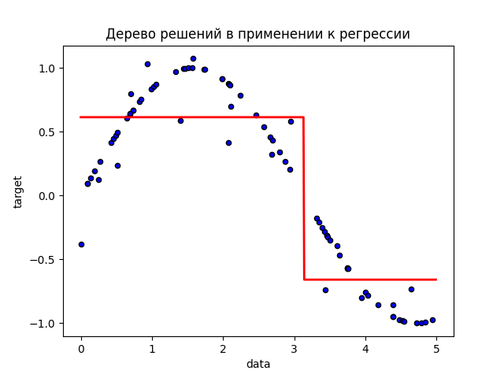

# Тестовое задание в Go Ahead

# Задача №1

> Вы работаете в отделе контроля качества компании Lego. Есть 30 наборов с деталями. В наборах неодинаковое количество деталей, но в каждом их больше 30. По стандарту, любая деталь должна весить ровно 1 грамм. Вы знаете, что в одном из наборов случился брак, и в нем детали весят по 1,01 грамм. Есть бесконечно точные весы, на которых можно сделать только одно взвешивание. Как за одно взвешивание определить, в каком наборе детали по 1,01 грамм?
> 

Для решения этой задачи сначала необходимо пронумеровать каждый набор с деталями. Затем из каждого набора нужно взять число деталей, которое соответствует его номеру (из первого набора - одну деталь, из второго — две, и т.д.) Таким образом, в общей сложности будет вытащено 465 деталей. Если бы все детали были стандартными, то их вес был бы равен 465 граммам. 

Зная это число, можно получить разность между ожидаемым весом и фактическим, $Real - expected = diff$. Зная это значение, можно вычислить номер бракованного набора, так как $diff = i * 0.01$. Отсюда номер $i$ легко находится как $i = diff /0.01$

# Задача №2

[https://lh6.googleusercontent.com/1F1ba9jme_B52NyTTTz_y4JZ6S-113gkFjF1i_xrxrWXGGBrfsdnOyNBPyXRcU7pnyjnjTssT_LjgU60BoMAVbM9l3HFsH5IDW-hFFdaBQTlObjJSUyMcInFIJguzfod01bxvT5i8VIGFmHOsw](https://lh6.googleusercontent.com/1F1ba9jme_B52NyTTTz_y4JZ6S-113gkFjF1i_xrxrWXGGBrfsdnOyNBPyXRcU7pnyjnjTssT_LjgU60BoMAVbM9l3HFsH5IDW-hFFdaBQTlObjJSUyMcInFIJguzfod01bxvT5i8VIGFmHOsw)

> Дана кусочно-постоянная функция F. Напишите на любом ЯП (предпочтительно Python 3) программу, которая принимает на вход массив A пар (x, y) длины n, и возвращает кортеж из трех элементов (a, b, c), соответствующих параметрам функции F, при которых среднеквадратическое отклонение функции от точек из A минимально. Визуализация решения приветствуется.
> 

Очевидно, данную задачу можно рассмотреть как применение дерева решений, глубина которого равна 1, максимальное количество дочерних узлов равно 2, а критерием оптимальности разделения является значение среднеквадратичной ошибки.

Используя средства языка Python, дерево решений можно реализовать разными способами.  В данной задаче я решил использовать фреймоворк машинного обучения scikit-learn.

В качесте тестовых данных был сгенерирован и сохранен в файл numbers.txt набор данных с помощью функции синуса с добавлением небольших выбросов.

Код предлагаемого решения  на языке Python 3.8:

```python
import argparse
import numpy as np
from sklearn.tree import DecisionTreeRegressor
from sklearn import tree
import matplotlib.pyplot as plt

parser = argparse.ArgumentParser(
    description="Decision Tree Regressor."
)
parser.add_argument(
    'filename', type=str, help='Filename with numeric data stored in tuples (x, y).'
)

def find_parameters(X: np.ndarray, y: np.ndarray) -> tuple:
    dec_tree_regression = DecisionTreeRegressor(
				max_depth=1,
				max_leaf_nodes=2,
				criterion='squared_error')

    dec_tree_regression.fit(X, y)

    X_test = np.arange(0.0, 5.0, 0.01)[:, np.newaxis]
    y_1 = dec_tree_regression.predict(X_test)

    c = dec_tree_regression.tree_.threshold[0]
    a = dec_tree_regression.tree_.value[1][0]
    b = dec_tree_regression.tree_.value[2][0]

    text_representation = tree.export_text(dec_tree_regression, feature_names=['x'])
    print(text_representation)

    plt.figure()
    plt.scatter(X, y, s=20, edgecolor="black", c="blue", label="data")
    plt.plot(X_test, y_1, color="red", linewidth=2)
    plt.xlabel("data")
    plt.ylabel("target")
    plt.title("Дерево решений в применении к регрессии")
    plt.savefig('plot.png')

    return c, a, b

if __name__ == "__main__":
    args = parser.parse_args()
    filename = args.filename

    X = list()
    y = list()

    with open(filename, 'r') as file:
        for line in file:
            line = line.split(',')
            X.append(float(line[0]))
            y.append(float(line[1]))

    X = np.array(X).reshape(-1, 1)
    y = np.array(y).ravel()

    c, a, b = find_parameters(X, y)

    print(f'c = {c}, a = {a[0]}, b = {b[0]}')
```

Для сгенерированных данных программа выдает следующуее значение параметров:

```bash
|--- x <= 3.13
|   |--- value: [0.61]
|--- x >  3.13
|   |--- value: [-0.66]

c = 3.1327505111694336, a = 0.6129390186381739, b = -0.6589781287054286
```



# Задача №3

> Дан [файл с данными](https://drive.google.com/file/d/1uP-HgF9yb_3HjCxC2EQ5xnn9nHY_jKon/view?usp=sharing). Каждая строчка - пользователь. Первая колонка - его id, вторая - LTV (life time value), третья - дата, когда он установил приложение.
 Напишите на любом ЯП (предпочтительно Python 3) скрипт, который подберет n интервалов LTV любого размера (возможно, неодинакового), таких, что в любую из дат установки в каждый интервал попадает в среднем 10 пользователей с LTV из данного интервала.  Т.е. результатом должен быть массив кортежей из двух элементов (начала и конца интервала).
 Любая визуализация решения приветствуется.


Условие данной задачи можно переформулировать таким образом: нужно разбить LTV на диапазоны таким образом, чтобы в любой из них из каждой группы пользователей (пользователи предварительно сгруппированны по дням установки приложения) входило в среднем 10 пользователей.

Перед написанием алгоритма я посмотрел на то, как выглядит данные и можно ли каким-то образом оптимизировать выборку по таблице. И действительно, оказалось, что большая доля пользователей имеет нулевое значение LTV (128403 из 182492) и их можно исключить из таблицы.

Также можно построить несложные визуализации для оценки данных:

```python

users_df['launches_in_day'] = users_df.groupby(['install_date'])['id'].transform('count')
users_df['id_with_ltv_value'] = users_df.groupby(['ltv', 'install_date'])['id'].transform('count')

ax = users_df.plot.scatter(x='install_date', y='ltv', figsize=(20, 10), c='launches_in_day', colormap='viridis')
ax.set_ylim(0.0, 20000.0)

ax2 = users_df.plot.scatter(x='install_date', y='ltv', figsize=(20, 10), c='id_with_ltv_value', colormap='viridis')
ax2.set_ylim(0.0, 30000.0)
```


На первом графике можно оценить число установок приложения в конкретный день, на втором — сколько пользователей  имеют конкретное значение ltv по дням.

## Алгоритм решения

Алгоритм предлагаемого решения заключается в том, что сначала необходимо итерироваться по уникальным значениям ltv, расширяя интервал от 0 до $ltv_i$  и каждый раз проверять среднее число пользователей по дням, входящих в образованный интервал. Если оно равно 10, то интервал сохраняется в список и значение нижней границы обновляется, иначе сдвигается верхняя граница.

Код предлагаемого решения на языке Python 3.8

```python
import pandas as pd

if __name__ == "__main__":
    users_df = pd.read_csv('task.csv')
    users_df = users_df.rename(columns={'Unnamed: 0': 'id'})
    users_df = users_df.drop(users_df.loc[users_df.ltv == 0].index)

    intervals = list()
    num_of_dates = users_df.install_date.nunique()
    ltv_start = 0
    for ltv_end in sorted(users_df.ltv.unique()):
        average_count = round(users_df.id.loc[
                                  (users_df.ltv > ltv_start) & (users_df.ltv <= ltv_end)
                                  ].count() / num_of_dates)
        if average_count == 10:
            intervals.append((ltv_start, ltv_end))
            print(f'({ltv_start}, {ltv_end}]')
            ltv_start = ltv_end
        elif average_count > 10:
            ltv_start = ltv_end
```

## Замечания по решению

- Полученные интервалы не являются непрерывными, **однако в условии задачи не сказано, что необходимо получить непрерывное разбиение на интервалы.**
- Код предлагаемого решения можно улучшить, обернув его в функцию, которая может разбивать диапазон значений $ltv$ на интервалы, где среднее значение числа входящих в интервалы пользователей **будет варьируемым параметром.**
- Визуализацию разбияния на интервалы можно реализовать несколькими способами:
    - с помощью отрисовки горизонтальных линий на представленном выше графике, но тогда на большом масштабе линиии будут сливаться:
    
    ```python
    ax = users_df.plot.scatter(x='install_date', y='ltv', figsize=(20, 5), cmap='magma', c='id_with_ltv_value')
    ax.set_ylim(0.0, 2000.0)
    for num, (first, last) in enumerate(intervals):
        ax.hlines(y=first, colors=colors[num], xmin=pd.Timestamp('2021-02-01 00:00:00'), xmax=pd.Timestamp('2021-06-30 00:00:00'))
        ax.hlines(y=last, colors=colors[num], xmin=pd.Timestamp('2021-02-01 00:00:00'), xmax=pd.Timestamp('2021-06-30 00:00:00'))
    ```
    
    
    
    - можно раскрасить точки в определенный цвет, тогда придется дополнять исходный датафрейм новой колонкой